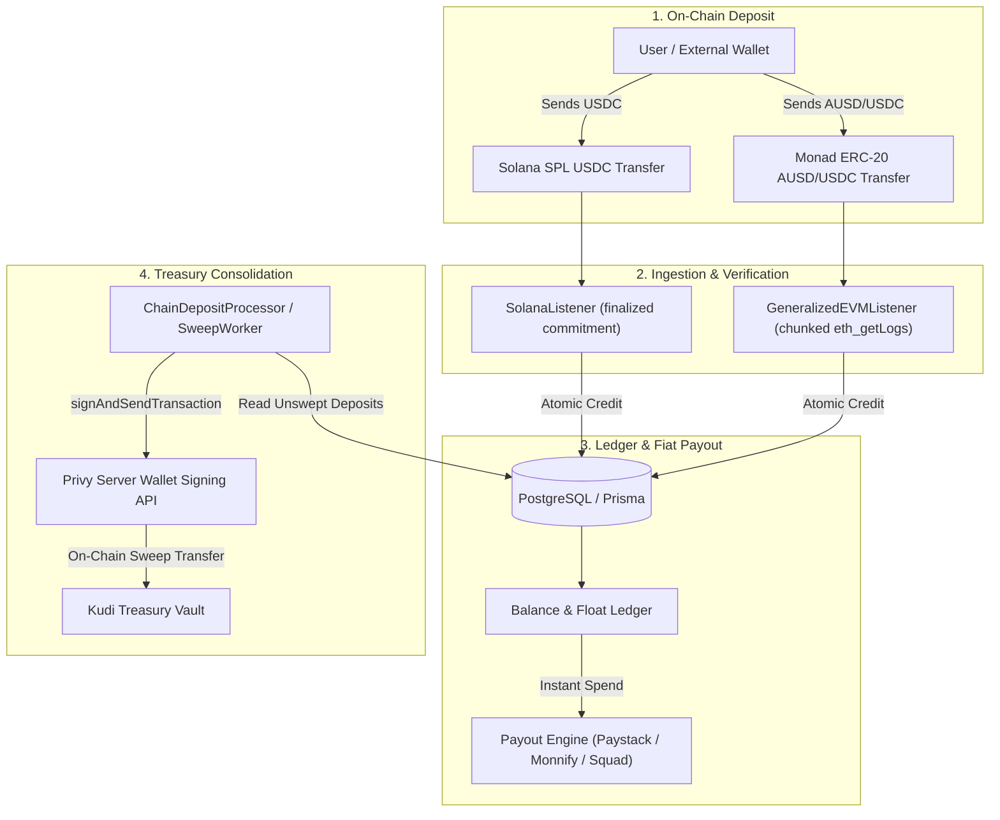
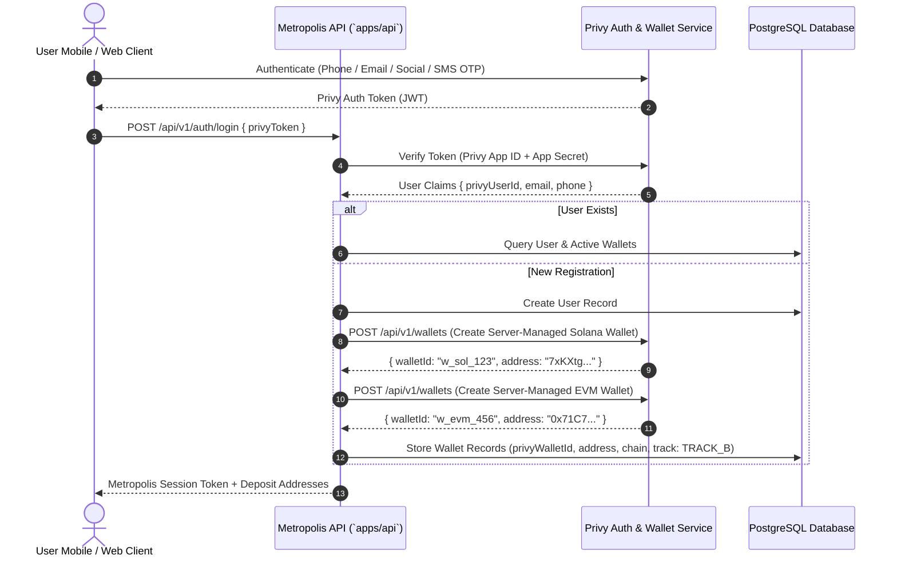
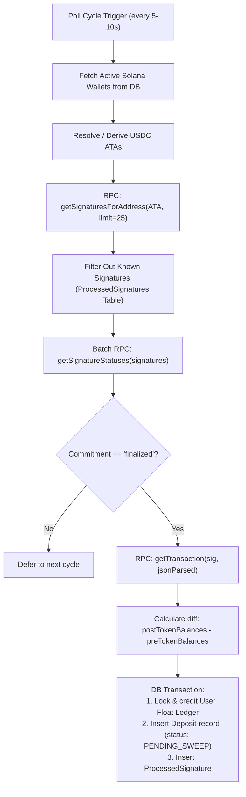
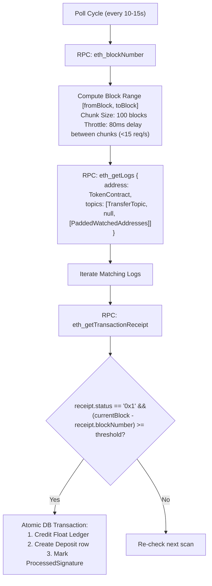
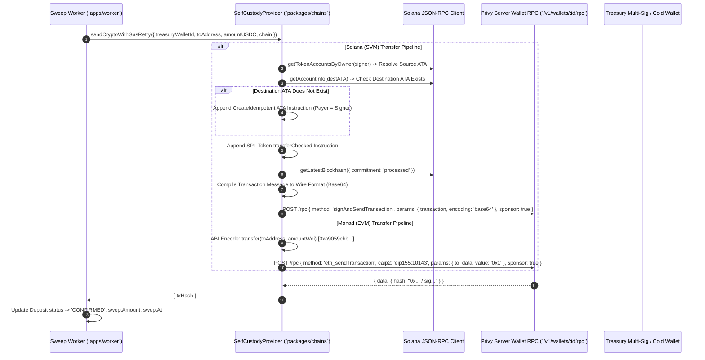
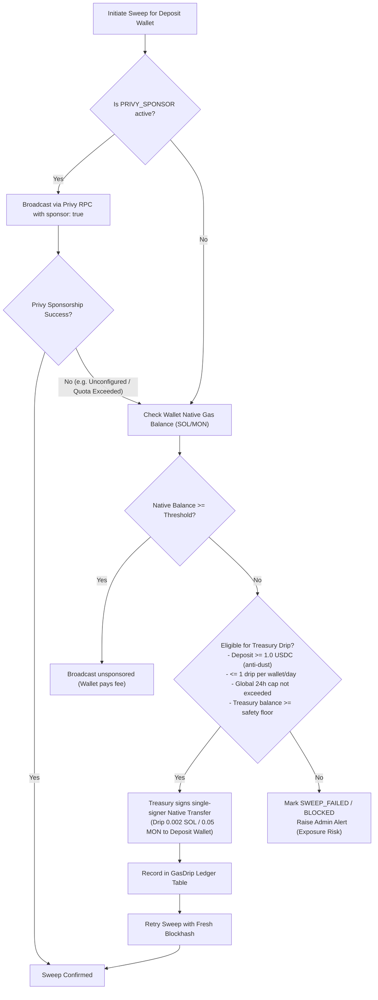

# Metropolis (Kudi) — Dual-Chain (SVM & EVM) Privy Architecture & Pre-Mainnet Sweep Strategy Specification

This document provides a comprehensive technical architecture specification for Privy account authentication, wallet derivation, deposit detection, and transaction sweeping across both **Solana (SVM)** and **Monad/Ethereum (EVM)**. 

It is designed as an authoritative design reference and research blueprint for a team of autonomous agents to evaluate, benchmark, and prototype sweeping architectures prior to mainnet launch.

---

## Table of Contents
1. [System Architecture & Lifecycle Overview](#1-system-architecture--lifecycle-overview)
2. [Privy Account, Authentication & Wallet Custody](#2-privy-account-authentication--wallet-custody)
3. [Deposit Detection Architecture (SVM & EVM)](#3-deposit-detection-architecture-svm--evm)
4. [Transaction Construction & Privy Signing Pipeline](#4-transaction-construction--privy-signing-pipeline)
5. [Gas Policy, Sponsorship & Treasury Drips](#5-gas-policy-sponsorship--treasury-drips)
6. [Pre-Mainnet Sweep Architectures: 8 Agent Exploration Pathways](#6-pre-mainnet-sweep-architectures-8-agent-exploration-pathways)
7. [Comparative Architectural Evaluation Matrix](#7-comparative-architectural-evaluation-matrix)
8. [Pre-Mainnet Implementation & Security Verification Checklist](#8-pre-mainnet-implementation--security-verification-checklist)

---

## 1. System Architecture & Lifecycle Overview

Metropolis (Kudi) bridges on-chain stablecoin deposits (USDC on Solana, AUSD/USDC on Monad) into instant Nigerian Naira (NGN) bank payouts. The end-to-end lifecycle follows an asynchronous credit-and-sweep pipeline:



### Key Architectural Invariants
1. **Detection Separated from Sweeping**: User ledger credit occurs immediately upon cryptographic confirmation (`finalized` on Solana, confirmation threshold on Monad). Payout is never blocked waiting for the treasury sweep to complete.
2. **Idempotent Ingestion**: Every deposit event is deduped on `(txHash, chain)` at the database level inside an atomic transaction.
3. **Fail-Closed Verification**: Deposit listeners never synthesize a confirmed transaction when an RPC call fails or times out.
4. **Single-Signer Constraint**: Privy Server Wallet APIs sign with one wallet ID per RPC request. A transaction requiring multiple signers (e.g., user authority + distinct treasury fee payer) cannot be executed in a single standard Privy call without multi-step co-signing.

---

## 2. Privy Account, Authentication & Wallet Custody

Metropolis implements a dual custody model: **Track A (Self-Custody Embedded Wallets)** and **Track B (Server-Custodial Deposit Wallets)**.



### Custodial Models
- **Track A (Embedded User-Held Wallets)**:
  - Private key shares split between the user device (via Privy SDK iframe/secure storage) and Privy Shamir recovery shares.
  - Metropolis backend **cannot** sign on behalf of the user.
  - Deposit sweeping requires user interaction (or delegated session keys). Therefore, Track A uses the **Float Model**: user deposit remains in their wallet, Metropolis credits the user's float ledger from internal reserves, and user balances are debited when spending.
- **Track B (Server-Managed Deposit Wallets)**:
  - Created via Privy Server Wallet REST API (`POST /api/v1/wallets`).
  - Metropolis holds authorization to request transaction signatures via Privy's REST API using its `PRIVY_APP_ID` and `PRIVY_APP_SECRET`.
  - Enables **unattended automated background sweeping** directly into the Kudi Treasury without requiring the user to be online.

---

## 3. Deposit Detection Architecture (SVM & EVM)

### 3.1. Solana (SVM) Deposit Detection Engine

Solana transactions differ fundamentally from EVM:
1. **Associated Token Accounts (ATAs)**: SPL tokens (like USDC) are held in token accounts derived as Program Derived Addresses (PDAs):
   $$\text{ATA} = \text{PDA}(\text{walletOwner}, \text{TokenProgram}, \text{Mint})$$
2. Deposits land on the **USDC ATA**, not the native wallet address.
3. Solana blocks have variable commitments: `processed` $\to$ `confirmed` $\to$ `finalized`.



#### Solana Listener Invariants (`packages/chains/src/solanaListener.ts`)
- **Strict Finality Gate**: Deposits are **only credited** when `confirmationStatus === 'finalized'` and `meta.err === null`.
- **Pre/Post Balance Extraction**: Deposit amounts are calculated from the actual delta in token balances:
  $$\Delta = |\text{postTokenBalances}[0].\text{uiAmount} - \text{preTokenBalances}[0].\text{uiAmount}|$$
- **Fail-Closed RPC**: Any 429 rate limit or parse error outputs `confirmed: false` and `amount: 0.00`. Fake credits are mathematically impossible.

---

### 3.2. Monad / Ethereum (EVM) Deposit Detection Engine

EVM token deposits emit the standard ERC-20 `Transfer` event:
$$\text{Transfer}(\text{address indexed from}, \text{address indexed to}, \text{uint256 value})$$
- Topic 0: `0xddf252ad1be2c89b69c2b068fc378daa952ba7f163c4a11628f55a4df523b3ef`
- Topic 2 (Recipient): 32-byte left-padded deposit address `0x000000000000000000000000{address}`



#### EVM Listener Invariants (`packages/chains/src/evmListener.ts`)
- **Block Chunking**: Monad testnet limits `eth_getLogs` to 100 blocks per request. Scans partition ranges into 100-block intervals with an 80ms delay to stay well under Monad's 25 req/sec ceiling.
- **Decimal Normalization**: Automatically normalizes 6-decimal tokens (USDC) and 18-decimal tokens (AUSD/native) into standard decimal currency before ledger credit.

---

## 4. Transaction Construction & Privy Signing Pipeline

Once a deposit is detected, credited, and recorded with `status = 'PENDING_SWEEP'`, the background sweep processor initiates the on-chain transfer to the Kudi Treasury.



### 4.1. Solana Transaction Wire Format Compilation
Solana requires constructing a Version 0 transaction message via `@solana/kit`:
```typescript
const txMessage = pipe(
  createTransactionMessage({ version: 0 }),
  (tx) => setTransactionMessageFeePayer(feePayerAddr, tx),
  (tx) => setTransactionMessageLifetimeUsingBlockhash(latestBlockhash, tx),
  (tx) => appendTransactionMessageInstruction(transferIx, tx)
);

// Privy expects the raw unsigned wire bytes formatted with placeholder signature slots:
const compiled = compileTransaction(txMessage);
const msgBytes = compiled.messageBytes;
const numSigs = Object.keys(compiled.signatures).length || 1;
const wireBytes = new Uint8Array(1 + (numSigs * 64) + msgBytes.length);
wireBytes[0] = numSigs; // Compact-u16 signature count
wireBytes.set(msgBytes, 1 + (numSigs * 64)); // Message follows empty 64-byte signature slots
const wireBase64 = Buffer.from(wireBytes).toString('base64');
```

### 4.2. The Solana Single-Signer Fee Payer Constraint
A critical constraint on Solana:
- In a standard SPL token transfer where Account A sends tokens to Treasury, Account A must sign as the **Token Authority**.
- If a separate Treasury Account B is designated as **Fee Payer**, the transaction requires **two signatures**: Signer A and Signer B.
- Privy's REST endpoint `/api/v1/wallets/${walletId}/rpc` executes against **a single wallet**. Privy cannot sign for both wallets in one invocation.
- Therefore, **the deposit wallet must act as its own fee payer** (`feePayerAddr = signerAddr`).

---

## 5. Gas Policy, Sponsorship & Treasury Drips

Because the deposit wallet must pay its own network fees on Solana, and deposit wallets are generated dynamically with zero initial native balance, sweeping requires gas management.

Metropolis implements a dual defense: **Privy Gas Sponsorship** + **Automated Treasury Native Gas Drip Fallback**.



### Gas Drip Anti-Farming Security Controls (`GasDrip` Table)
1. **Dust Floor**: Wallets with deposits under 1.0 USDC are ineligible for native gas drips to prevent draining treasury funds through micro-deposits.
2. **Frequency Cap**: Maximum 1 drip per wallet per 24-hour sliding window.
3. **Global Daily Limit**: Maximum 0.5 SOL total treasury drips across all wallets per 24 hours.
4. **Treasury Safety Reserve**: Drips automatically halt if the Treasury native balance falls below 0.5 SOL.

---

## 6. Pre-Mainnet Sweep Architectures: 8 Agent Exploration Pathways

To determine the optimal, production-hardened sweeping strategy for mainnet launch, 8 autonomous agents can explore, benchmark, and prototype the following architectures:

---

### Pathway 1: Enhanced Server-Custody with Automated Native Drips (Baseline)
- **Assigned Agent**: `agent-1-drip-orchestrator`
- **Core Concept**: Keep the existing Track B server-custodial architecture with single-signer deposit wallets. Enhance the Treasury Gas Drip engine with BullMQ queue concurrency, batch drips, and automated gas replenishment.
- **SVM Implementation**: Deposit wallet pays its own Solana fee (~0.000005 SOL). If balance is zero, Treasury sends 0.002 SOL via `SystemProgram.transfer`, waits for confirmation, then broadcasts the SPL `transferChecked`.
- **EVM Implementation**: Same flow: Treasury drips 0.01 MON if balance is under gas floor.
- **Pros**:
  - Fully compatible with standard Solana SPL and EVM ERC-20 token contracts.
  - No smart contract deployments or custom programs required.
- **Cons / Risks**:
  - Two sequential on-chain transactions per sweep (Drip $\to$ Sweep) doubles latency and increases RPC cost.
  - Small residual native dust remains in deposit wallets after sweep.

---

### Pathway 2: Pure Float & Deferred Consolidation (Track A Float Model)
- **Assigned Agent**: `agent-2-float-risk-analyst`
- **Core Concept**: Eliminate real-time individual sweeps entirely. Treat user wallets as decentralized float reserves. Deposits are credited to the internal ledger immediately, and funds remain on deposit addresses until an aggregate threshold (e.g., \$10,000 or 24 hours) triggers a scheduled batch consolidation.
- **Mechanics**:
  - Payouts are funded directly from the Kudi Liquidity Float.
  - Only when a wallet's balance exceeds a high threshold does a batch worker fund and sweep it.
- **Pros**:
  - Zero gas costs for small/frequent deposits.
  - Payout latency is 100% decoupled from chain congestion.
- **Cons / Risks**:
  - Capital inefficiency (large float required in payout bank accounts).
  - Unswept exposure: if an exploit or user key compromise occurs, un-swept deposits can be drained before consolidation.

---

### Pathway 3: Privy Gas Sponsorship Relayer (Zero-Drip Paymaster)
- **Assigned Agent**: `agent-3-privy-paymaster-auditor`
- **Core Concept**: Rely 100% on Privy's native Gas Sponsorship policy engine. Deposit wallets never hold or receive native SOL or MON.
- **SVM Implementation**: Configure Privy Gas Sponsorship rules via Privy Dashboard for Solana. Privy acts as the fee payer via its internal relayer network.
- **EVM Implementation**: Configure Privy ERC-4337 or EIP-1559 paymaster relayer on Monad.
- **Pros**:
  - Exactly 1 transaction per sweep (zero drip transactions).
  - No native balance management or drip farming attack surface.
  - Zero leftover dust in deposit wallets.
- **Cons / Risks**:
  - Vendor lock-in to Privy's relayer uptime and sponsorship rate limits.
  - If Privy sponsorship fails or exhausts billing quotas, sweeps immediately stop unless an automatic fallback exists.

---

### Pathway 4: Account Abstraction (ERC-4337) & Solana Token-2022 Transfer Hooks
- **Assigned Agent**: `agent-4-smart-contract-engineer`
- **Core Concept**: Deploy smart accounts for deposit addresses rather than raw keypairs.
- **EVM (Monad)**: Deploy ERC-4337 Smart Contract Accounts (e.g., Kernel / Biconomy / Safe) as deposit addresses. The sweep transaction is bundled with a Paymaster that accepts payment in the deposited stablecoin itself (ERC-20 gas payment) or is sponsored by Kudi's paymaster contract.
- **SVM (Solana)**: Utilize Solana **Token-2022** with **Transfer Hook** or **Fee Payer Extension**, allowing fee delegation or automatic fee deduction directly from the transferred token.
- **Pros**:
  - Institutional-grade architecture; standard for enterprise crypto on-ramps.
  - Paymaster handles gas without native token funding.
- **Cons / Risks**:
  - High initial development overhead (contract auditing, bundler infrastructure).
  - Monad testnet bundler/ERC-4337 ecosystem maturity needs verification.

---

### Pathway 5: Ephemeral Pre-Funded Deposit Vaults
- **Assigned Agent**: `agent-5-ephemeral-vault-manager`
- **Core Concept**: Fund deposit wallets with exact gas at creation time rather than at sweep time.
- **Mechanics**:
  - When a user registers or requests a deposit address, Metropolis provisions the address and sends exactly 0.005 SOL / 0.02 MON in the background.
  - When the deposit arrives, the wallet is already funded and executes the sweep in one single transaction.
  - When swept, the sweep transaction sweeps both the token and the remaining native gas back to the Treasury in the same transaction or batch.
- **Pros**:
  - Real-time sweeps happen with 0 delay (no waiting for drip confirmation).
  - Blockhash freshness issues are minimized.
- **Cons / Risks**:
  - Capital tied up in inactive deposit addresses (idle float).
  - Griefing risk: malicious users generate thousands of accounts to drain pre-funded gas.

---

### Pathway 6: Event-Driven Indexer & Push-Stream Sweeps
- **Assigned Agent**: `agent-6-stream-indexer-architect`
- **Core Concept**: Replace HTTP RPC polling with real-time WebSocket or Webhook streams (e.g., Helius Geyser / LaserStream on Solana, Alchemy / QuickNode Streams on Monad).
- **Mechanics**:
  - Stream triggers an instant BullMQ event within 200ms of transaction confirmation.
  - Worker prepares and broadcasts the sweep transaction within the same slot or block.
- **Pros**:
  - Sub-second sweep initiation.
  - Eliminates polling RPC load and 429 rate limit exceptions.
- **Cons / Risks**:
  - Requires reliable webhook receiver endpoints with signature verification.
  - Still requires a solution for gas funding (best paired with Pathway 1 or Pathway 3).

---

### Pathway 7: In-Flight Fee Deduction & Auto-Swap Sweeping
- **Assigned Agent**: `agent-7-dex-fee-settler`
- **Core Concept**: Deposit wallets execute an in-flight swap of a small portion of the deposited USDC (e.g., \$0.05) into native SOL/MON via Jupiter (Solana) or a DEX router (Monad), using Jito Bundles or flash-minted temporary lamports.
- **Mechanics**:
  - The incoming token pays for its own transfer fee.
  - Zero treasury capital required for gas.
- **Pros**:
  - Complete self-sufficiency: no treasury drip, no sponsor bill, no native balance management.
- **Cons / Risks**:
  - High complexity: requires DEX liquidity, slippage management, and complex transaction composition.
  - Solana requires an existing token account and initial signature fee.

---

### Pathway 8: Dual-Signer Co-Signing Proxy / Threshold Relay
- **Assigned Agent**: `agent-8-multisig-copay-engineer`
- **Core Concept**: Solve the Solana 2-signer constraint without moving away from Privy by deploying a lightweight Treasury Co-Signing Relay.
- **Mechanics**:
  1. Metropolis API constructs the Version 0 Solana transaction with:
     - Signer A (Deposit Wallet) as **Authority**.
     - Signer B (Treasury Wallet) as **Fee Payer**.
  2. Step 1: Call Privy RPC to sign with Wallet A (returns partially signed transaction wire bytes).
  3. Step 2: Call Privy RPC to sign the resulting wire bytes with Treasury Wallet B.
  4. Step 3: Broadcast the fully signed 2-signature transaction to Solana RPC.
- **Pros**:
  - Treasury pays fees directly for all sweeps with **zero drips** and **zero gas in deposit wallets**.
  - No leftover native dust.
  - Treasury funds are centralized in one monitored wallet.
- **Cons / Risks**:
  - Requires two sequential Privy API calls per sweep.
  - Blockhash expiration risk during the two API round-trips.

---

## 7. Comparative Architectural Evaluation Matrix

| Metric | Pathway 1: Native Drips | Pathway 2: Pure Float | Pathway 3: Privy Sponsor | Pathway 4: Account Abstraction | Pathway 5: Pre-Funded Vaults | Pathway 6: Push Streams | Pathway 7: In-Flight Swap | Pathway 8: Dual-Signer Relay |
| :--- | :---: | :---: | :---: | :---: | :---: | :---: | :---: | :---: |
| **Sweep Latency** | Slow (2 txs) | None (Batch) | Fast (1 tx) | Medium (Bundler) | Fast (1 tx) | Real-Time | Medium | Fast (1 tx, 2 API calls) |
| **Gas Cost Efficiency** | Low (drip fee overhead) | Very High | High | Medium | Medium | Medium | High | High |
| **Dust Leakage** | Yes (~$0.05/wallet) | No | None | None | Low | Depends | None | None |
| **Implementation Complexity** | Low (Built) | Low | Low | Very High | Medium | Medium | Very High | Medium |
| **Attack Surface / Griefing** | Drip farming | Float default | Quota drain | Contract bugs | Vault gas drain | Webhook DoS | DEX slippage | Blockhash lag |
| **Vendor Dependency** | Low (Self-custody) | None | High (Privy) | Medium | Low | Medium | High (DEX) | Medium (Privy) |
| **Solana (SVM) Fit** | Verified | Verified | Relayer-dependent | Token-2022 only | Verified | High | Complex | Highly Recommended |
| **Monad (EVM) Fit** | Verified | Verified | Verified | Native 4337 | Verified | High | Complex | Verified |
| **Mainnet Readiness** | **Ready Now** | **Ready Now** | Needs Dashboard Setup | Post-Mainnet | Post-Mainnet | Ready Now | Research | **Top Candidate** |

---

## 8. Pre-Mainnet Implementation & Security Verification Checklist

Before enabling automated sweeps on mainnet, the following security gates must pass:

- [ ] **Dual-Signer Relay Prototype (Pathway 8)**: Test whether Privy's `signTransaction` endpoint supports sequential signing of a Version 0 transaction on Solana without blockhash expiration.
- [ ] **Privy Gas Sponsorship Dashboard Quotas**: Ensure production tier has sufficient sponsorship limits and auto-recharge rules active for both CAIP-2 chains (`solana:mainnet` and `eip155:10143`/Monad).
- [ ] **Simulation Before Broadcast**: Ensure `sendCrypto` simulates transactions via `simulateTransaction` (Solana) and `eth_estimateGas` (EVM) before submitting to Privy to prevent burning gas on reverting sweeps.
- [ ] **Un-swept Liability Circuit Breaker**: Maintain real-time monitoring of $\sum \text{UnsweptDeposits} - \text{TreasuryBalance}$. If exposure exceeds safety limits, automatically throttle fiat payout thresholds.
- [ ] **Automated Key Rotation & Secrets Audit**: Verify all production credentials (`PRIVY_APP_SECRET`, DB passwords, RPC API keys) are sourced from secure runtime environment variables or secret managers, with zero presence in Git history.
- [ ] **RPC Endpoint Redundancy**: Ensure both Solana and Monad engines have primary and fallback RPC endpoints with automatic failover on HTTP 429/503 status codes.
